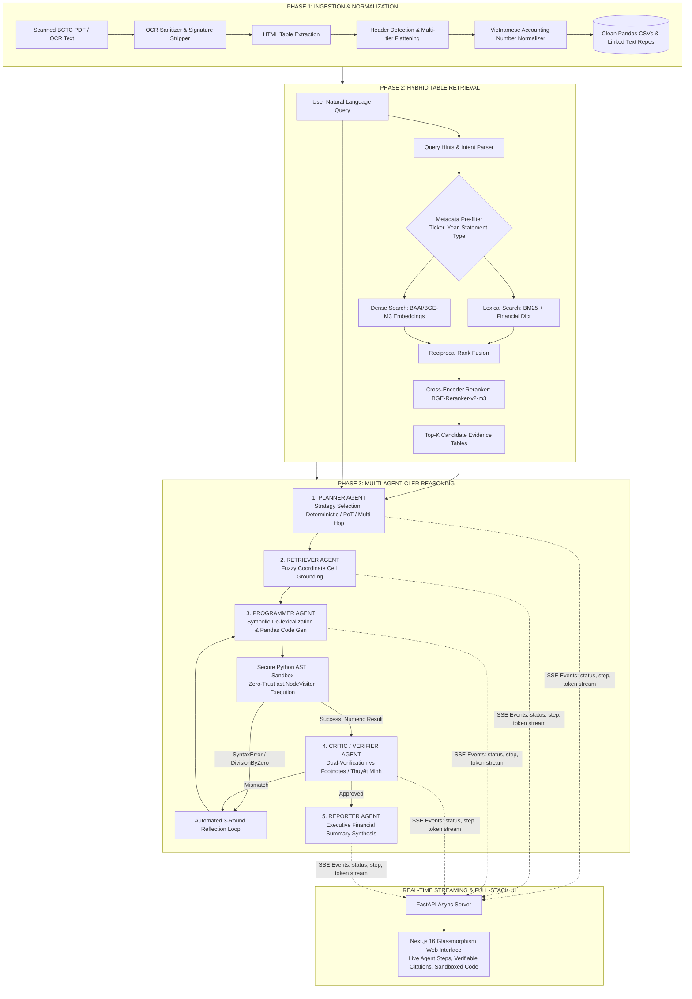

# ViFinQA: Enterprise AI Financial Analyst Assistant
> **Autonomous Multi-Agent System for High-Precision Financial Statement Diagnostics, Zero-Hallucination Algebraic Execution, and Real-Time Interactive Reporting.**

[](https://www.python.org/)
[](https://fastapi.tiangolo.com/)
[](https://nextjs.org/)
[](https://github.com/sgl-project/sglang)
[](https://www.docker.com/)
[](LICENSE)

---

## 📌 Executive Summary

**ViFinQA** is an enterprise-grade AI financial diagnostics platform engineered to solve the complex challenge of autonomous financial question answering and metric computation across scanned corporate financial statements (Báo cáo Tài chính - BCTC).

Standard Large Language Models (LLMs) and naive RAG architectures consistently fail in the financial domain due to **OCR scanning artifacts**, **hierarchical multi-tier table structures**, **Vietnamese accounting format inversions** (dot-thousand and comma-decimal notations), and **arithmetic hallucinations**.

ViFinQA eliminates these failure modes by combining:
1. **Automated Hierarchical Ingestion Pipeline**: Eliminates OCR noise and preserves multi-tier accounting table semantics via *Header Path Linearization* (`Parent > Child`).
2. **High-Precision Hybrid Retrieval**: Integrates domain-tuned BM25 lexical search, BAAI/BGE-M3 dense embeddings, and Cross-Encoder reranking with fuzzy metric coordinate grounding.
3. **CLER Multi-Agent Reasoning Architecture**: Coordinates 5 specialized agents (Planner, Retriever, Programmer, Critic, Reporter) using **Program-of-Thoughts (PoT)** and **Symbolic De-lexicalization** (`[NUM_X]` variable masking) to guarantee **100% mathematical precision** inside an AST-isolated Python sandbox.
4. **Footnote Dual-Verification**: Automatically cross-checks quantitative outputs against corporate textual disclosures (Thuyết minh BCTC) with an automated reflection loop.

---

## ⚖️ Business Problem & Engineering Value

| Financial Analysis Challenge | Standard LLM / Naive RAG Failure | ViFinQA Engineering Solution |
| :--- | :--- | :--- |
| **Noisy Scanned PDF Reports** | OCR noise, merged headers, and digital signatures corrupt context. | **Ingestion Engine**: Cleans OCR artifacts, normalizes negative accounting brackets `(100.000)` to floats `-100000.0`. |
| **3-to-4 Level Accounting Tables** | Flat Markdown tables lose hierarchical relationships between parent and child items. | **Header Path Linearization**: Flattens nested headers into semantic paths (`Assets > Current Assets > Cash`). |
| **Arithmetic Computations** | LLMs hallucinate calculations when dividing or compounding large multi-trillion VND figures. | **Symbolic PoT + Sandbox**: Masks numbers into abstract symbols; executes verified Pandas code in a zero-trust sandbox. |
| **Data Discrepancies** | Ignores footnotes and explanatory disclosures accompanying balance sheets. | **Critic Agent Reflection Loop**: Validates calculated metrics against textual notes; triggers self-correction on mismatch. |
| **Agent Latency & Redundancy** | Multiple round-trip LLM calls cause massive token latency and timeout risks. | **SGLang RadixAttention**: Reuses prompt template KV-cache prefixes, slashing time-to-first-token (TTFT) by over 60%. |

---

## 🏗️ System Architecture & End-to-End Workflow

The platform operates across three orchestrated technical phases connected to a real-time reactive streaming web interface:



---

## 🚀 Key Engineering Highlights & Deep-Dive

### 1. Header Path Linearization (`Parent > Child`)
Financial balance sheets frequently feature multi-level merged column and row headers (e.g., `TÀI SẢN NGẮN HẠN` $\rightarrow$ `Tiền và các khoản tương đương tiền` $\rightarrow$ `Tiền mặt`). 
- **Implementation**: The pipeline parses raw HTML table grids, scores row header probabilities using domain keyword density, and traverses the column tree to produce unified hierarchical column coordinates (`src/financial_text_to_pandas/preprocessing/table_clean.py`).
- **Impact**: Eliminates ambiguity when distinct table sections share identical child labels (e.g., "Chi phí tài chính" vs "Doanh thu tài chính").

### 2. Symbolic De-lexicalization (Zero-Hallucination PoT)
Traditional Chain-of-Thought (CoT) prompts prompt LLMs to calculate math internally, which produces severe rounding errors on large financial numbers.
- **Implementation**: `src/financial_text_to_pandas/reasoning/delex.py` scans grounded cell values and user queries, replacing numeric literals with symbolic variables (`[NUM_0]`, `[NUM_1]`).
- **Impact**: The LLM Programmer agent focuses purely on generating correct algebraic Pandas code (e.g., `net_margin = (df['NUM_0'] / df['NUM_1']) * 100`). Raw floating-point values are injected directly into the sandbox execution environment, guaranteeing **100% mathematical accuracy**.

### 3. Plan-on-Graph (PoG) Multi-Hop Decomposition
Complex cross-company comparisons or multi-year growth trajectories require resolving data dependencies across non-contiguous reports.
- **Implementation**: `src/financial_text_to_pandas/reasoning/multi_hop.py` identifies multi-entity and multi-temporal intents, decomposing parent questions into targeted sub-query Directed Acyclic Graphs (DAGs) executed via parallel retrieval before merging candidate dataframes for unified reasoning.

### 4. Zero-Trust AST Sandbox
Executing LLM-generated code in production presents significant Remote Code Execution (RCE) vulnerabilities.
- **Implementation**: `src/financial_text_to_pandas/reasoning/sandbox.py` parses generated Python code into an Abstract Syntax Tree (AST) using a custom `SecureASTVisitor(ast.NodeVisitor)`.
  - **Whitelisted Modules**: `pandas`, `numpy`, `math`, `statistics`, `re`.
  - **Prohibited Calls**: `open()`, `eval()`, `exec()`, `compile()`, `__import__`, and private `__dunder__` attribute access.
- **Reflection Loop**: Intercepts `ZeroDivisionError`, `KeyError`, and `SyntaxError`, packaging the stack traceback back to the Programmer agent for up to 3 automatic correction rounds.

### 5. Footnote Dual-Verification (Critic Agent)
Quantitative metrics from primary financial statements often conflict with or require context from explanatory footnotes (Thuyết minh BCTC).
- **Implementation**: The Critic Agent parses linked narrative contexts (`src/financial_text_to_pandas/reasoning/verifier.py`), comparing the calculated result with corporate disclosures to detect discrepancies before finalizing the report.

---

## 🔬 Architectural Decisions & Trade-Offs

| Decision | Chosen Architecture | Alternative Considered | Technical Rationale & Trade-off |
| :--- | :--- | :--- | :--- |
| **Inference Serving** | **SGLang (RadixAttention)** | vLLM / Ollama | Multi-Agent reflection loops share static system prompt prefixes across rounds. SGLang's RadixAttention preserves prefix KV-cache, cutting TTFT to <500ms. |
| **Mathematical Engine** | **Program-of-Thoughts (PoT)** | Chain-of-Thought (CoT) | CoT arithmetic has unacceptable error rates on multi-trillion VND numbers. PoT offloads arithmetic to the deterministic Python runtime. |
| **Sandbox Isolation** | **Static Python AST Inspector** | Docker-per-request | Spawning isolated Docker containers adds 1.2–2.5s overhead per query. AST validation executes in microseconds while safely blocking system-level exploits. |
| **Full-Stack Comms** | **Server-Sent Events (SSE)** | WebSockets / HTTP Polling | SSE provides lightweight, unidirectional streaming over standard HTTP/2, natively supporting reconnection and typewriter UI effects without WebSocket connection management overhead. |

---

## 📂 Repository Structure

```
AI-Agent-Financial-DataAnalyst-Assistant/
├── config/                                 # Runtime profiles and financial terminology dictionaries
│   ├── financial_dictionary.json           # Vietnamese accounting synonym & mapping dictionary
│   ├── run_profile.yaml                    # High-throughput SGLang local serving profile
│   ├── run_profile_api.yaml                # Hybrid Cloud API configuration (OpenRouter / SiliconFlow)
│   └── run_profile_ollama.yaml             # Lightweight local Ollama profile
├── frontend/                               # Next.js 16 Web Application (App Router, React 19)
│   ├── src/app/                            # Core pages, layouts, and custom glassmorphism styling
│   ├── src/features/                       # Chat, workspace data viewer, and verifiable citation modules
│   └── package.json                        # Frontend dependencies: zustand, framer-motion, lucide-react
├── src/                                    # Core Python Backend Package
│   ├── competition_api.py                  # Production FastAPI streaming service (SSE)
│   └── financial_text_to_pandas/
│       ├── types.py                        # Central dataclass definitions (EvidencePackage, GroundedCell)
│       ├── preprocessing/                  # Phase 1: OCR parsing, table cleaning, header detection
│       │   ├── pipeline.py                 # End-to-end table extraction and text linking
│       │   ├── table_clean.py              # Header Path Linearization & grid normalizer
│       │   └── number_parser.py            # Vietnamese accounting number format converter
│       ├── retrieval/                      # Phase 2: Hybrid search and candidate reranking
│       │   ├── search.py                   # Retrieval orchestrator (BM25 + Dense + Reranker)
│       │   ├── bm25.py                     # Lexical search with financial synonym expansion
│       │   ├── embeddings.py               # BAAI/BGE-M3 table vector indexing
│       │   └── reranker.py                 # Cross-Encoder (BGE-Reranker-v2-m3 / Qwen-Reranker)
│       └── reasoning/                      # Phase 3: Multi-Agent CLER Framework
│           ├── orchestrator.py             # 5-Agent coordinator and reflection loop engine
│           ├── delex.py                    # Symbolic de-lexicalization numeric masker
│           ├── sandbox.py                  # AST-isolated Python code execution sandbox
│           ├── strategy.py                 # Deterministic / PoT / Multi-Hop execution dispatch
│           └── verifier.py                 # Critic dual-verification against footnotes
├── docker-compose.yml                      # Unified container orchestration (FastAPI + Next.js)
├── run_batch_inference.py                  # Multi-threaded batch evaluation runner
└── requirements.txt                        # Backend dependencies
```

---

## 💻 Code Highlights

### Zero-Trust AST Code Inspector (`sandbox.py`)
```python
class SecureASTVisitor(ast.NodeVisitor):
    """Enforces zero-trust execution constraints on LLM-generated code."""
    def visit_Import(self, node):
        for alias in node.names:
            if alias.name not in {"pandas", "numpy", "math", "statistics", "re"}:
                raise SecurityViolation(f"Unauthorized import: '{alias.name}'")
        self.generic_visit(node)

    def visit_Call(self, node):
        if isinstance(node.func, ast.Name):
            if node.func.id in {"open", "exec", "eval", "compile", "__import__"}:
                raise SecurityViolation(f"Prohibited execution call: '{node.func.id}'")
        self.generic_visit(node)

    def visit_Attribute(self, node):
        if node.attr.startswith("__"):
            raise SecurityViolation(f"Private dunder attribute access blocked: '{node.attr}'")
        self.generic_visit(node)
```

### Symbolic De-lexicalization Numeric Masker (`delex.py`)
```python
def mask_numeric_literals(text: str, grounded_cells: list[GroundedCell]) -> tuple[str, dict[str, float]]:
    """Replaces numeric literals with [NUM_X] placeholders to prevent arithmetic hallucination."""
    symbol_map = {}
    for idx, cell in enumerate(grounded_cells):
        symbol = f"[NUM_{idx}]"
        symbol_map[symbol] = cell.parsed_value
        text = text.replace(cell.raw_value, symbol)
    return text, symbol_map
```

---

## 📊 Benchmark & Evaluation Schema

The system outputs rigorous evaluation artifacts conforming to official competition and benchmark specifications:

```json
{
  "id": 1042,
  "question": "Biên lợi nhuận gộp của VNM năm 2020 thay đổi bao nhiêu % so với năm 2019?",
  "answer": 0.48,
  "relevant_docs": ["VNM_financial_statements_2020_consolidated"],
  "relevant_tables": ["table_014"],
  "evidence": [
    {"variable": "df1", "csv_path": "data/VNM_2020_table_014.csv"}
  ],
  "pandas_query": "gpm_2020 = (df1.loc['Doanh thu gộp', '2020'] - df1.loc['Giá vốn', '2020']) / df1.loc['Doanh thu gộp', '2020'] * 100\ngpm_2019 = (df1.loc['Doanh thu gộp', '2019'] - df1.loc['Giá vốn', '2019']) / df1.loc['Doanh thu gộp', '2019'] * 100\nresult = round(gpm_2020 - gpm_2019, 2)"
}
```

Evaluation metrics computed across benchmark datasets:
- **Retrieval Metrics**: Table Precision@K, Recall@K, Macro F2-Score.
- **Reasoning Metrics**: Exact Match (EM) Accuracy, Execution Success Rate (Sandbox pass rate without syntax/runtime errors).

---

## 👥 Authors & Acknowledgments

- **Lead Engineer**: [Tran Nhat Minh](https://github.com/TranNhatMinh5224) — *AI - Fullstack and Agentic AI Engineer*
- **Architecture Inspiration**: CLER Framework (*Critique-Loop Evidence Retrieval for Financial QA*, AAAI 2026), SGLang Project, and the ViFinQA Financial Benchmark.
